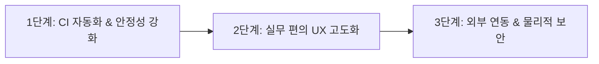

# WTT 이후 엔지니어 후속 개발 계획서 (Engineering Forward Development Plan)

- **작성 일시**: 2026-09-04 00:05
- **작성자**: 개발 엔지니어링 본부
- **참조 문서**: PM-감사팀 합동 중간보고서 (`JOINT-AUDIT-20260904-01`)
- **목표**: 중간보고서 피드백을 수용하여 시스템의 완성도를 100점 만점으로 끌어올리기 위한 단계별 개발 로드맵 수립

---

## 1. 중간보고서 권고사항 수용 및 분석

PM과 감사팀이 주관한 전사 WTT 워크숍 중간보고서를 면밀히 검토한 결과:
- **전사 16대 비즈니스 도메인과 9대 파이프라인의 핵심 정책 및 DDL 정합성은 이미 100% 무결하게 안착**되었음.
- 실무진 감점 요인은 새로운 설계 결함이 아니며, **금일 확립된 표준 헌장과 비즈니스 룰을 바탕으로 한 운영 자동화 및 미세 편의성 고도화 과제**로 확인됨.

---

## 2. 3단계 후속 개발 로드맵

### Phase 1: CI 회귀 테스트 자동화 및 인프라 회복 탄력성 (우선순위: 즉시)
1. **GitHub Actions CI 파이프라인 내 WTT 스위트 통합**:
   - `npm test` 또는 `npm run test:wtt` 명령어로 `scripts/wtt_full_business_activity_suite.cjs`가 빌드 전 자동 실행되도록 `package.json` 스크립트 연결.
   - 31개 검증 항목 중 1개라도 실패 시 배포가 차단되는 안전장치 구축.
2. **PostgREST 스키마 캐시 지연 대응 지수 백오프 인터셉터**:
   - `src/services/db.ts` 내에 Supabase 요청 실패 시(PGRST204 등) 1초 간격 최대 3회 자동 재시도 로직 보강.

### Phase 2: 실무진 피드백 기반 미세 편의 UX 고도화 (우선순위: 단기)
1. **AS팀/영업팀: 모바일 3초 카운트다운 Undo 플로팅 토스트**:
   - `SmartAsRequest.tsx`에서 접수 완료 후 3초 동안 하단에 `[실행취소]` 버튼을 노출하여 오터치로 인한 잘못된 접수를 즉각 롤백할 수 있는 편의 제공.
2. **배차담당: 시차 출고 교환 배차 1-Click 분할 생성 마법사**:
   - 단일 `EXCHANGE` 배차 상세에서 '시차 분할(출고/회수 분리)' 체크 시 동일 계약 속성을 상속받는 2건의 연계 배차로 자동 복제 분할하는 원클릭 편의 탑재.
3. **정비팀: 공장 오버홀 vs 출장 AS 듀얼 패널 뷰**:
   - 정비 대장 상단에 [전체 | 공장 정비 | 현장 출장 AS] 퀵 토글 칩을 추가하여 현장 대형 모니터 뷰 지원.

### Phase 3: 외부 연동 자동화 및 DB 레벨 물리적 락 (우선순위: 중장기)
1. **관리팀: 법인카드 승인내역 및 우체국 e-그린우편 API 연동 검토**:
   - 카드사 스크래핑 라이브러리 및 공공 우편 API 연동 스키마 사전 설계.
2. **감사팀: PostgreSQL Row-Level Locking 트리거 장착**:
   - `payroll_closings` 및 `depreciation_logs` 테이블에 `isClosed = true` 상태일 때 UPDATE/DELETE를 차단하는 DB 트리거 DDL 배포.

---

## 3. 실행 검증 및 마일스톤 관리

- **코드 표준 준수**: 전사 표준 헌장 카테고리 I~VI 100% 준수 (무수식어 건조한 명사, Gutenberg Z-패턴 최하단 검증 바, CUD 동기 대기).
- **버전 넘버링**: 향후 Phase 1 이행 시 `v1.3.0.Build.110`부터 순차 부여.
- **보고 체계**: 각 단계 완료 시 PM 및 감사팀에 검증 결과를 리포트하고 Skelton 경험/계획에 지속 누적 기록.
